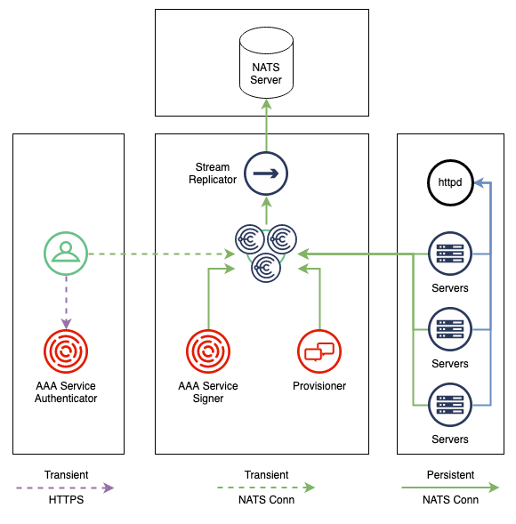

## Overview

A Docker Composed based Choria environment with:

 * [Choria Broker](https://choria-io.github.io/go-choria/broker/)
 * [Choria Provisioner](https://choria-io.github.io/provisioner/)
 * [Choria AAA Service](https://choria-io.github.io/aaasvc/)
 * [Choria Server](https://choria-io.github.io/go-choria/server/) including [message submit](https://choria.io/docs/streams/submission/)
 * Choria Registry Service enabled on the servers
 * Choria Client with Registry access
 * [Choria External Agent](https://choria.io/docs/development/mcorpc/externalagents/) called `requests`
 * Sample System Info gathering [Autonomous Agent](https://choria.io/docs/autoagents/)
 * Sample [Choria Scout](https://choria.io/docs/scout/) health check
 * Registration data publishing and Choria [Adapters](https://choria.io/docs/adapters/)
 * [Choria Streams](https://choria.io/docs/streams/)
 * [NATS Server](https://nats.io) with the `nats` CLI to demonstrate Stream Replicator
 * [Stream Replicator](https://choria-io.github.io/stream-replicator/)
 * An Apache HTTP server that serves choria plugins like the Requests Agent

This demonstrates a deployment method that does not rely on Puppet or Certificate Authorities for security.

Instead we developed an ed25519 based security system that is now in use by Servers, Clients, Provisioning and AAA this removes the need
for Certificate Authorities while significantly enhancing the features of the security system

Primarily this demonstrates the work in [issue #1740](https://github.com/choria-io/go-choria/issues/1740)
as documented in the [ADR](https://choria-io.github.io/go-choria/adr/001/index.html)

There is no Puppet anywhere on this setup, it's self provisioning and self configuring. This will form the basis of deployments in Enterprises
and in Kubernetes environments where we cannot rely on Puppet.

## Network Components

We create 4 networks with the various components deployed, no TCP traffic can move from Client to Servers directly.



The network hosting a NATS Server will have data replicated to it, it will be completely disconnected from any Choria infrastructure unable to influence them in any way, but it will get a real time copy of node metadata via Stream Replicator.

**NOTE:** While this shows 2 seperate AAA components, in this case we deploy one process that runs 2 services.

## Requirements

You need docker with docker compose, this probably only works on Linux and Intel Macs.

## Setup

> [!NOTE]
>
> The network that these steps build is isolated and cannot be accessed remotely.
>
> Add the following below as part of the `broker.choria` instance in the `docker-compose.yaml` file to allow it, but be aware any Choria instance that can connect would be provisioned. You must be sure not to put this on the internet.
>
> ```
> ports:
>  - "4222:4222"
> ```

Run `docker compose pull` to ensure you have the latest nightly builds locally

Run `docker compose up --scale server.choria=10` to run 10 Choria servers.

Run `docker compose exec client.choria bash -l` to get a shell.

Once in the shell do:

```
$ choria login
? Username:  choria
? Password:  ******
Token saved to /home/choria/.choria/token
```

The password is `secret`.

From there basics like `choria req choria_util info` will function until your
JWT expire in a hour.

The `choria` user above is a basic user, there's also an `admin` user with full
access to all subjects on the broker.

For example `choria` could not do `choria broker s backup CHORIA_EVENTS /tmp/events`
while the `admin` user can.

Once you are done with the demo stop it and run `docker compose down -v` to remove the credentials volume and other temporary stores.

## Features Exploration

Below we'll explore a few features enabled in this network. You do not need to know all this stuff to use Choria, but for those interested in exploring it in depth this is useful. Most sites will not use 1/2 these features.

#### System Facts Gathering

The `facts` Autonomous Agent will gather system facts using the `github.com/AstroProfundis/sysinfo` go package,
it will save the result into `/etc/choria/facts.json`. The first gather should run within a minute or so of startup
and then every 10 minutes.

We can check the full inventory of the nodes by first finding a hostname using `choria ping`:

```nohighlight
$ choria ping
f735e80db804.choria.local                time=4 ms
...

---- ping statistics ----
10 replies max: 12ms min: 11ms avg: 12ms overhead: 44ms
```

Then `choria inventory <fqdn>` which will show facts:

```
$ choria inventory f735e80db804.choria.local
Inventory for f735e80db804.choria.local

...

  Facts:

    {
      "bios": {
        "date": "03/14/2014",
        "vendor": "BHYVE",
        "version": "1.00"
      },
...
```

We can also do a quick report of memory size:

```
$ choria facts memory.size
Report for fact: memory.size

  7959 found 10 times

Finished processing 10 / 10 hosts in 418ms
```

Facts are a key enabler for discovery, you can address RPC requests using filters:

```
[choria@client /]$ choria req rpcutil ping -F memory.size=7959
Discovering nodes using the mc method .... 10
```

Discovery is a big topic, explore [Choria Discovery](https://choria.io/docs/concepts/discovery/) for details.

### Autonomous Agents

The server instances are configured to support [Autonomous Agents](https://choria.io/docs/autoagents/)
with 2 examples in `config/server/machine`, any others you add there will immediately activate
without requiring restart of the nodes.

**NOTE** The following section requires nightly or release newer than 2025-03-17.

Autonomous agents can be deployed to the servers via a KV bucket and webserver.

We have an example of this that deployed the `check_choria` plugin.

We verify there is currently no scout check deployed to the server:

```
$ choria scout status eb9614dded4c.choria.local

1 / 1    0s [==============================================================================] 100%

╭─────────────────────────────────────╮
│        Scout status history         │
├──────┬───────┬────────────┬─────────┤
│ Name │ State │ Last Check │ History │
├──────┼───────┼────────────┼─────────┤
╰──────┴───────┴────────────┴─────────╯

Finished processing 1 / 1 hosts in 27ms
```

Plugin deployment requires carefully constructed packages that has a number of checksums to ensure integrty:

```
$ cd ~
$ cp -R plugins/check_choria .
$ cd check_choria
$ sha256sum * > ../SHA256SUMS
$ mv ../SHA256SUMS .
$ cd ~
$ tar -cvzf htdocs/check_choria-1.0.0.tar.gz check_choria
$ sha256sum htdocs/check_choria-1.0.0.tar.gz
6dadcfda84b2ae7bdcf7fa2573a6b4e8a04570031858b1a87ab942dd17e172d9   htdocs/check_choria-1.0.0.tar.gz
$ sha256sum check_choria/SHA256SUMS
ba67c8357518b0ec557315590b8b18cfc6a762e4d0cce8ed191bf75f17f29448   plugins/check_choria/SHA256SUMS
```

We then add the URL for the plugin and its checksums to a manifest file (replace with the checksums from above).

```
$ choria machine plugins add check_choria http://plugins.choria.local/check_choria-1.0.0.tar.gz 6dadcfda84b2ae7bdcf7fa2573a6b4e8a04570031858b1a87ab942dd17e172d9 ba67c8357518b0ec557315590b8b18cfc6a762e4d0cce8ed191bf75f17f29448
```

Finally we pack the manifest into a signed specification

```
$ choria machine plugins pack plugins.json credentials/plugin-signer.seed > spec.json
```

At this point we have a file `spec.json` that holds a signed manifest of plugins to deploy. It gets added to a KV bucket where the servers will deploy it.

```
$ choria kv add CHORIA_PLUGINS
$ cat spec.json |choria kv put CHORIA_PLUGINS plugins -- -
```

After a minute or two you will see the plugin being downloaded and deployed in the server logs and `choria inventory` will show the `check_choria` Autonomous Agent loaded. The server(s) will log:

```
plugins_manager#manage_machines: Deploying plugin check_choria from http://plugins.choria.local/check_choria-1.0.0.tar.gz into /etc/choria/machine
mm_check_choria#download: Archive http://plugins.choria.local/check_choria-1.0.0.tar.gz was deployed successfully to check_choria
```

We will see there is now a scout check deployed:

```
$ choria scout status eb9614dded4c.choria.local

1 / 1    0s [==============================================================================] 100%

╭─────────────────────────────────────────────────────────────╮
│                    Scout status history                     │
├──────────────┬─────────┬──────────────────────────┬─────────┤
│ Name         │ State   │ Last Check               │ History │
├──────────────┼─────────┼──────────────────────────┼─────────┤
│ check_choria │ UNKNOWN │ 2562047h47m16.854775807s │         │
╰──────────────┴─────────┴──────────────────────────┴─────────╯

Finished processing 1 / 1 hosts in 25ms
$ choria scout trigger
$ choria scout status eb9614dded4c.choria.local
[choria@client ~]$ choria scout status eb9614dded4c.choria.local

1 / 1    0s [==============================================================================] 100%

╭─────────────────────────────────────────────╮
│            Scout status history             │
├──────────────┬───────┬────────────┬─────────┤
│ Name         │ State │ Last Check │ History │
├──────────────┼───────┼────────────┼─────────┤
│ check_choria │ OK    │ 13s        │ OK      │
╰──────────────┴───────┴────────────┴─────────╯

Finished processing 1 / 1 hosts in 28ms
```


#### Scout Status

**NOTE** This requires the section about Autonomous Agents above to have been followed.

Choria Scout are some foundational monitoring capability built into Choria and we have 1 check active that checks Choria itself.

Lets make sure all nodes have done a check:

```
$ choria scout trigger
...
Finished processing 10 / 10 hosts in 414ms
```

Now we can check one of the nodes status, might be interesting to run `choria scout watch` (requires `choria login` as `admin`)
in another terminal before running this what you will see is CloudEvents issued by Autonomous Agent system about state changes:

```
$ choria scout status c41fdd9c6c82.choria.local

1 / 1    0s [==============================================================================] 100%

╭─────────────────────────────────────────────╮
│            Scout status history             │
├──────────────┬───────┬────────────┬─────────┤
│ Name         │ State │ Last Check │ History │
├──────────────┼───────┼────────────┼─────────┤
│ check_choria │ OK    │ 2m3s       │ OK      │
╰──────────────┴───────┴────────────┴─────────╯

Finished processing 1 / 1 hosts in 49ms
```

### Choria Streams

[Choria Streams](https://choria.io/docs/streams/) is enabled by default and usable from the `streams` or `admin` user.

The Choria Server is publishing the system metadata gathered using Autonomous Agents regularly and Choria Adapter transforms
that away from Choria protocol messages into another format, lets set up a stream to capture those messages.

Here I am showing just the answers that require changes, just accept defaults for the rest.

```
$ choria broker stream add CHORIA_REGISTRATION
? Subjects choria.node_metadata.>
? Per Subject Messages Limit 5
? Message TTL 1d

Stream CHORIA_REGISTRATION was created

Information for Stream CHORIA_REGISTRATION created 2022-12-13 10:41:23
...
```

After a minute or two your servers will publish data into the stream full of registration data:

```
$ choria broker s state CHORIA_REGISTRATION
State for Stream CHORIA_REGISTRATION created 2022-12-13 10:41:23

State:

             Messages: 20
                Bytes: 37 KiB
             FirstSeq: 1 @ 2022-12-13T10:41:33 UTC
              LastSeq: 20 @ 2022-12-13T10:43:15 UTC
     Active Consumers: 0
   Number of Subjects: 10
```

We can see the raw messages that will be [choria:adapters:choria_streams:output:1](https://github.com/choria-io/schemas/blob/master/choria/adapters/choria_streams/v1/output.json) messages holding [horia:registration:inventorycontent:1](https://github.com/choria-io/schemas/blob/master/choria/registration/v1/inventorycontent.json) messages:

```
$ choria broker s view CHORIA_REGISTRATION
```

### Choria Stream Replicator

The purpose of Stream Replicator is to move data from one NATS JetStream based server to another.  In Choria land that often means moving data from Choria Broker in a datanceter to a centralised NATS JetStream Server for processing, data mining and more.

Here we have it set up to move the `CHORIA_REGISTRATION` stream from Choria Broker to a standalone NATS Server.

Once the `CHORIA_REGISTRATION` is created you will notice in logs the Stream Replicator component stops logging errors, from then on the data stored in `CHORIA_REGISTRATION` stream made in the previous section will be copied to a standard NATS Server that is running outside of the Choria network.

We can confirm this is working using the `nats` instance:

```
$ docker compose exec nats.choria sh -l
nats:~# nats stream list
╭─────────────────────────────────────────────────────────────────────────────────────────────╮
│                                           Streams                                           │
├─────────────────────┬─────────────┬─────────────────────┬──────────┬─────────┬──────────────┤
│ Name                │ Description │ Created             │ Messages │ Size    │ Last Message │
├─────────────────────┼─────────────┼─────────────────────┼──────────┼─────────┼──────────────┤
│ CHORIA_REGISTRATION │             │ 2023-01-10 14:04:50 │ 1        │ 2.0 KiB │ 32.23s       │
╰─────────────────────┴─────────────┴─────────────────────┴──────────┴─────────┴──────────────╯
```

Data mining can now hypothetically happen on this isolated NATS Server and settings like retention values for how long data is to be kept can be configured differently here than in the specific data centers.

We can view the copied data and note additional information is included:

```
nats:/# nats s get -S 'choria.node_metadata.*.choria.local' CHORIA_REGISTRATION
Item: CHORIA_REGISTRATION#80 received 2023-01-12 13:58:02.307709499 +0000 UTC on Subject choria.node_metadata.d4ed2655ddae.choria.local

Headers:
  Choria-SR-Source: CHORIA_REGISTRATION 20 COMPOSE COMPOSE 1673531882307

{"protocol":"choria:adapters:choria_streams:output:1",......
```

The header indicates that Source of this message so that one can track back from replication target to source.  Here we can see it's from the `CHORIA_REGISTRATION` stream with sequence `20` and was sent at `1673531882307` milliseconds since Unix epoch.

```
nats:/# date -d @$(  echo "(1673531882307 + 500) / 1000" | bc)
Thu Jan 12 13:58:02 UTC 2023
```

We can fetch the source message in the Choria Broker and compare time stamps:

```
$ choria broker s get CHORIA_REGISTRATION 20
Item: CHORIA_REGISTRATION#20 received 2023-01-12 13:58:02.307152119 +0000 UTC on Subject choria.node_metadata.d4ed2655ddae.choria.local
....
```

We can see the timestamps align the message had sub 1 second delay from being created in the source till being replicated into the target.

Additionally we have the [End-to-End Latency Monitoring](https://choria-io.github.io/stream-replicator/monitoring/index.html#end-to-end-latency-monitoring) feature enabled, publishing to `choria.node_metadata._monitor` regularly.

### Choria Broker

The [Choria Broker](https://choria-io.github.io/go-choria/broker/) is the main point of communication between Clients and Servers
it also provides a few other features like Choria Streams (an embedded NATS JetStream server) and Data Adapters.

Here we'll show how to interact with it for monitoring and status gathering, you should have logged in as `admin` using `choria login`.

Let's look at the running server, in a Production setup you would see clusters of Brokers here.

In order to access any of these commands your user needs to have `org_admin` or `system_user` permissions and you need these lines in
both the Broker and Client config:

```ini
plugin.choria.network.system.user = system
plugin.choria.network.system.password = s3cret
```

**HINT:** The commands here under `choria broker ...` are mostly from the [NATS CLI](https://github.com/nats-io/natscli).

```
$ choria broker server list
╭────────────────────────────────────────────────────────────────────────────────────────────────────────────────────────╮
│                                                    Server Overview                                                     │
├────────┬─────────┬────────┬─────────┬─────┬───────┬──────┬────────┬─────┬────────┬───────┬───────┬──────┬────────┬─────┤
│ Name   │ Cluster │ Host   │ Version │ JS  │ Conns │ Subs │ Routes │ GWs │ Mem    │ CPU % │ Cores │ Slow │ Uptime │ RTT │
├────────┼─────────┼────────┼─────────┼─────┼───────┼──────┼────────┼─────┼────────┼───────┼───────┼──────┼────────┼─────┤
│ broker │ CHORIA  │ broker │ 2.9.9   │ yes │ 33    │ 160  │ 0      │ 0   │ 57 MiB │ 0     │ 8     │ 0    │ 25m31s │ 3ms │
├────────┼─────────┼────────┼─────────┼─────┼───────┼──────┼────────┼─────┼────────┼───────┼───────┼──────┼────────┼─────┤
│        │ 1       │ 1      │         │ 1   │ 33    │ 160  │        │     │ 57 MiB │       │       │ 0    │        │     │
╰────────┴─────────┴────────┴─────────┴─────┴───────┴──────┴────────┴─────┴────────┴───────┴───────┴──────┴────────┴─────╯

╭────────────────────────────────────────────────────────────────────────────╮
│                              Cluster Overview                              │
├─────────┬────────────┬───────────────────┬───────────────────┬─────────────┤
│ Cluster │ Node Count │ Outgoing Gateways │ Incoming Gateways │ Connections │
├─────────┼────────────┼───────────────────┼───────────────────┼─────────────┤
│ CHORIA  │ 1          │ 0                 │ 0                 │ 33          │
├─────────┼────────────┼───────────────────┼───────────────────┼─────────────┤
│         │ 1          │ 0                 │ 0                 │ 33          │
╰─────────┴────────────┴───────────────────┴───────────────────┴─────────────╯
```

We can now see individual connections to the server:

```
$ choria broker server  report  connections

╭────────────────────────────────────────────────────────────────────────────────────────────────────────────────────────────────────────────────────────────────────────────╮
│                                                                    Top 33 Connections out of 33 by subs                                                                    │
├─────┬─────────────────────────────────────────────┬─────────────────────┬─────────┬─────────────┬──────────────┬────────┬─────────┬──────────┬──────────┬───────────┬──────┤
│ CID │ Name                                        │ Server              │ Cluster │ IP          │ Account      │ Uptime │ In Msgs │ Out Msgs │ In Bytes │ Out Bytes │ Subs │
├─────┼─────────────────────────────────────────────┼─────────────────────┼─────────┼─────────────┼──────────────┼────────┼─────────┼──────────┼──────────┼───────────┼──────┤
│ 6   │ registration_0-f77632c7106148239f0020561 .. │ broker.choria.local │ CHORIA  │ 172.20.0.2  │ choria       │ 26m13s │ 26      │ 0        │ 46 KiB   │ 0 B       │ 0    │
│ 7   │ registration_1-a815c443dbc143329756f4497 .. │ broker.choria.local │ CHORIA  │ 172.20.0.2  │ choria       │ 26m13s │ 26      │ 0        │ 46 KiB   │ 0 B       │ 0    │
│ 10  │ registration_2-8151f4cba9e44a199f5cd24cf .. │ broker.choria.local │ CHORIA  │ 172.20.0.2  │ choria       │ 26m13s │ 26      │ 0        │ 46 KiB   │ 0 B       │ 0    │
│ 21  │ registration_3-f76cbcf495d44f9a86656b323 .. │ broker.choria.local │ CHORIA  │ 172.19.0.2  │ choria       │ 26m13s │ 26      │ 0        │ 46 KiB   │ 0 B       │ 0    │
│ 22  │ registration_4-2e62536bc6b94d4c8ae777044 .. │ broker.choria.local │ CHORIA  │ 172.19.0.2  │ choria       │ 26m12s │ 26      │ 0        │ 46 KiB   │ 0 B       │ 0    │
...
```

And internal data of the JetStream system:

```
$ choria broker server  report  jetstream
╭────────────────────────────────────────────────────────────────────────────────────────────────────╮
│                                         JetStream Summary                                          │
├────────┬─────────┬─────────┬───────────┬──────────┬─────────┬────────┬─────────┬─────────┬─────────┤
│ Server │ Cluster │ Streams │ Consumers │ Messages │ Bytes   │ Memory │ File    │ API Req │ API Err │
├────────┼─────────┼─────────┼───────────┼──────────┼─────────┼────────┼─────────┼─────────┼─────────┤
│ broker │ CHORIA  │ 5       │ 0         │ 315      │ 370 KiB │ 0 B    │ 370 KiB │ 21      │ 0       │
├────────┼─────────┼─────────┼───────────┼──────────┼─────────┼────────┼─────────┼─────────┼─────────┤
│        │         │ 5       │ 0         │ 315      │ 370 KiB │ 0 B    │ 370 KiB │ 21      │ 0       │
╰────────┴─────────┴─────────┴───────────┴──────────┴─────────┴────────┴─────────┴─────────┴─────────╯
```

There are many other monitoring related commands here, review the [Broker Documentation](https://choria-io.github.io/go-choria/broker/monitoring/).

### Choria Server

Each managed node runs [Choria Server](https://choria-io.github.io/go-choria/server/) under Auth Provisioning, this hosts all the
components that runs on nodes like Autonomous Agents.

Log into one of the servers and note the configuration was generated from Provisioner:

```
# head -n1 /etc/choria/server.conf
# configuration file written in request 64b7aeee527d4645be12f9c2520197ed from provisioner_signer (provisioner_signer) at 2022-12-13 10:25:11.529747313 +0000 UTC m=+0.772990914
```

We can check its status (this is what the Scout watch also checks):

```
# cat /var/log/choria-status.json
{"identity":"39933eff58a8.choria.local","uptime":2250,"connected_server":"nats://broker.choria.local:4222","last_message":1670928037,"provisioning_mode":false,"stats":{"total":12,"valid":12,"invalid":0,"passed":12,"filtered":0,"replies":12,"ttlexpired":0},"certificate_expires":"0001-01-01T00:00:00Z","token_expires":"2023-12-13T10:13:54Z"}

# choria tool status --status-file /var/log/choria-status.json --provisioned --no-disconnected
/var/log/choria-status.json OK
```

Above is a NAGIOS format check that verifies various aspects of a running Choria Server.

We'll revisit the server again in other sections like Provisioning.

The Server hosts a `Requests Agent` that's a RPC agent built using the [External Agent Package](https://github.com/choria-io/go-external) and
deployed in `/var/lib/choria/plugins/agent`.  When accessed the server will spawn this binary on demand. The source for this agent can be found at GitHub [https://github.com/ripienaar/requests-agent](https://github.com/ripienaar/requests-agent).

#### Message Submission

Choria Server supports a feature called [Message Submit](https://choria.io/docs/streams/submission/) that is usually used along with Choria Streams. The purpose is so that Cron Jobs and more can send messages into Streams without having their own Stream Network connection, credentials etc.  The server handles that and will do retries and so forth.

Let's create a Stream to accept message, leave everything default:

```
client$ choria broker s add SUBMIT --subjects 'choria.submission.in.>'
```

Now we'll submit our first message:

```
server# echo "Hello" | choria tool submit --config /etc/choria/server.conf --reliable hello.world  -- -
aa648bee-8de5-4dd3-b7f9-e5dd50ef3f06
```

The message is stored to a local spool and the Choria Server will now try and deliver it. After a short while it will be stored in Streams

```
[choria@client ~]$ choria broker s get SUBMIT 1
Item: SUBMIT#1 received 2022-12-13 11:30:25.934433527 +0000 UTC on Subject choria.submission.in.hello.world

Headers:
  Choria-Created: 1670931025097201012
  Choria-Identity: 39933eff58a8.choria.local
  Choria-Priority: 4
  Choria-Sender: user 0
  Nats-Msg-Id: 34c85aab-8836-4a9d-b065-555bc3da5a87

Hello
```

If the data is sensitive in nature you can publish it with a signature made by the Choria Server by adding `--sign`:

```
server# echo "Hello" | choria tool submit --config /etc/choria/server.conf --reliable --sign hello.world  -- -
36b59cb1-6714-4400-a622-18a6a571ab9e
```

```
[choria@client ~]$ choria broker s get SUBMIT 2
Item: SUBMIT#2 received 2022-12-13 11:32:50.831156999 +0000 UTC on Subject choria.submission.in.hello.world

Headers:
  Nats-Msg-Id: 36b59cb1-6714-4400-a622-18a6a571ab9e
  Choria-Created: 1670931170230399340
  Choria-Identity: 39933eff58a8.choria.local
  Choria-Priority: 4
  Choria-Reliable: 1
  Choria-Sender: user 0
  Choria-Signature: 374c510bb94fc867b0b93bdb80779c5a1e4f9afb92820427e18eab9c0ff4c2aced6934f334b95fd9c645732284e4eca1a766ec0483a695be3a4d69212fa2fc0a
  Choria-Token: eyJhbGciOiJFZERTQSIsInR5cCI6IkpXVCJ9.eyJpZGVudGl0eSI6IjM5OTMzZWZmNThhOC5jaG9yaWEubG9jYWwiLCJjb2xsZWN0aXZlcyI6WyJjaG9yaWEiXSwicGVybWlzc2lvbnMiOnsic3VibWlzc2lvbiI6dHJ1ZSwic3RyZWFtcyI6dHJ1ZSwic2VydmljZV9ob3N0Ijp0cnVlfSwib3UiOiJjaG9yaWEiLCJwdXJwb3NlIjoiY2hvcmlhX3NlcnZlciIsInRjcyI6ImJjNjlmMzE1NGM2OGUyMmQ5NmViM2U5YTg1OGNhOWJiZTE1ZjBhMDBiMTc4ODJmZjg3ZDFlMGUxZTBmOWU0MjExZDUwYmEzYzczZTc4MzMwYzBiNWI5ZTVmMjUyMmU1ZmI4M2Q0MjBmZDE4ZTZhNzMyZDY2ZDI2MzNiYjE1ZjBjLjVjMjZiYWZmNTE2N2MzMDJkY2EzMzNkYzE3ZGQ3YjZmZWEyZjA5MGVhYTRkM2FhNWVkYzdjOTMzZDBiYmM2YzAyNDZjNTdhMGNlN2U2ZDYxMjQxMjdhNzhiYzA5ODNiZjM5MWZkYjY0MTllYTdlYzkxOTQ2NGUyZjUxYjY5MTA3IiwicHVibGljX2tleSI6ImFhNWQ4MTk5ZjE3OWFmZWU4MDEwMTFjNzZlNWYwZDU0NWZhMDE2YWUzMzZmYTBhOGUzNDlkMmJjZTJlMjQzZTkiLCJpc3NleHAiOjE3MDI0NjI0MzQsImlzcyI6IkMtYzMwZTU3NTYwZDY2NDBkZDk2YTU0MTRlNDFhOGU1ZTQuNzM2OWNiZGUwZTQzZDI4ZjAyZTdhYmE3OWYzNDgwN2YyNzNjMTgwOTcwYzA1MWE3NmVlOTg2MTJlZjg3NDMzYSIsImV4cCI6MTcwMjQ2MzExMSwibmJmIjoxNjcwOTI3MTExLCJpYXQiOjE2NzA5MjcxMTEsImp0aSI6IjU5OTRjMWE1NzU2MjRmMWM5M2ZhOTgxNGRlYmIyMDVjIn0.N2jyXU7h7g6uwYPVqWI6hmhGjs8BNLWgACeovzBKCReQHvRb9zTWza2ZWoYaDtYBQz4a2xWtES6MfDndV_p2Bg

Hello
```

Here we have:

 * A `Choria-Token` that is the Server JWT signed by the relevant Choria Provisioner and that can be verified using the Organization Issuer public key.  This token holds a Public ed25519 key that was verified as being correct during provisioning.
 * A `Choria-Signature` which is a ed25519 message signature hex encoded made using the Public Key in the `Choria-Token`.

Using this method you can fully verify the origin and validity of a message - if validated whoever sent it had the server private key.

### Client and Registry

Choria Clients are nodes / user accounts where you access Choria Servers via RPC or components in the Choria Broker like Streams.

In this deployment we demonstrate a minimal client setup via only installing the `choria` RPM and creating `/etc/choria/client.conf` that reference files in user directories.

#### JWT

The client has no credentials at start, no public keys, private keys or anything. When running `choria login` the following happens:

 * A ed25519 key-pair is made in `~/.config/choria`
 * A request is constructed to the login service that is signed by the private key
 * The Login server creates a JWT based on your user profile that embeds the public key
 * The token is saved in `~/.config/choria`
 * On each connection to the broker a NONCE is signed using the Private key and the JWT is sent to the Broker
 * Various layer of Authorization happens for every connection or request

You can view the JWT:

```
$ choria jwt ~/.config/choria/client.jwt
Unvalidated Client Identification Token /home/choria/.config/choria/client.jwt

          Caller ID: up=admin
  Organization Unit: choria
         Public Key: 4457ff80ae033839f99c49242ae997925d10c72eb56291046f3f59b46b618fad
 Private Network ID: 868a936112914bff2105e739a7566941
         Expires At: 2022-12-13 11:50:36 +0000 UTC (11m19s)
        Trust Chain: Issued by a000d6be262f498fb80a8c628eb02477

 Client Permissions:

      Can manage Choria fleet nodes subject to authorizing signature
      Can observe all traffic on all subjects and access the system account
      Can access the Broker system account

         OPA Policy: package io.choria.aaasvc

                     default allow = true
```

Try logging in as `choria`, `streams` and `admin` to see how the Permissions change.

#### Registry

In order to interact with RPC services Clients need DDL files - service schemas. These are a pain to maintain on client machines as often Desktops are not under Configuration Management.

We support a Service Registry where plugin DDLs are fetched on demand. An example is the `requests` agent, the client does not know this exist at start.

**NOTE:** The requests agent is deployed as a plugin at run time and can take a minute or two to exist

```
$ choria plugin doc requests
Requests Agent version 0.0.1

Network requests agent

Plugin Metadata:

    Author: R.I.Pienaar <rip@devco.net>
       URL: https://choria.io
   License: Apache-2.0
   Timeout: 120
  Provider: external

Available Action: download, request
...
```

Here it realised the `requests` agent is unknown and attempted to fetch it from the Registry.

We can do `choria plugin doc` to list all plugins which would download all plugin schemas.

The registry is enabled in clients using `plugin.choria.services.registry.cache = ~/.config/choria/registry` and on Servers using `plugin.choria.services.registry.store = /var/lib/choria/plugins`.

The Registry is a `Choria Service Agent`, it means it is a horizontally scaled service where any 1 server that hosts the service will respond to requests.  Here we run it on every server so its 10 x redundantly deployed and load balanced automatically.

#### Requests Agent

**NOTE:** The requests agent is deployed as a plugin at run time and can take a minute or two to exist

Let's see how the `requests` works, each of the servers host one of these.

```
$ choria req requests request url=http://plugins.choria.local/
Discovering nodes using the mc method .... 10

10 / 10    0s [==============================================================================] 100%

...

Summary of Status Code:

   200: 10


Finished processing 10 / 10 hosts in 1.14s
```

You should see requests logged by the httpd server.

**HINT:** Try adding `--batch 1 --batch-sleep 10` to see the client batching features

#### Go Client Library

I won't go into detail about using this library, but you can generate a Golang client for the `requests` agent easily.

We need the agent schema that was fetched from the registry:

```
$ mkdir requests
$ choria plugin generate client ~/.config/choria/registry/agent/requests.json requests
INFO[0000] Writing Choria Client for Agent requests Version 0.0.1 to requests
INFO[0000] Writing requests/action_download.go for action download
INFO[0000] Writing requests/action_request.go for action request
INFO[0000] Writing requests/ddl.json
INFO[0000] Writing requests/client.go
INFO[0000] Writing requests/ddl.go
INFO[0000] Writing requests/discover.go
INFO[0000] Writing requests/doc.go
INFO[0000] Writing requests/initoptions.go
INFO[0000] Writing requests/logging.go
INFO[0000] Writing requests/requester.go
INFO[0000] Writing requests/resultdetails.go
INFO[0000] Writing requests/rpcoptions.go
```

We'll quickly grab Golang onto the client and show it's a full valid Go package. This client is easy to use scales to 10s of thousands of servers.

```
$ curl -OL https://go.dev/dl/go1.19.4.linux-amd64.tar.gz
$ tar -xzf go1.19.4.linux-amd64.tar.gz
$ ./go/bin/go doc ./requests
package requestsclient // import "."

Package requestsclient is an API client to the Choria Requests agent Version
0.0.1.

Actions:
  - Request - Performs a HTTP request
  - Download - Downloads a file

const DisplayDDL = DisplayMode(iota) ...
const OK = StatusCode(iota) ...
func DDL() (*agent.DDL, error)
func DDLBytes() ([]byte, error)
type BroadcastNS struct{ ... }
type DisplayMode uint8
type DownloadOutput struct{ ... }
type DownloadRequester struct{ ... }
type DownloadResult struct{ ... }
type ExternalNS struct{ ... }
type FilterFunc func(f *protocol.Filter) error
type InitializationOption func(opts *initOptions)
    func Discovery(ns NodeSource) InitializationOption
    func DiscoveryMethod(m string) InitializationOption
    func DiscoveryTimeout(t time.Duration) InitializationOption
    func Logger(l *logrus.Entry) InitializationOption
    func Progress() InitializationOption
type Log interface{ ... }
type MetaNS struct{ ... }
    func NewMetaNS(opts *discovery.StandardOptions, enablePipeMode bool) *MetaNS
type Metadata struct{ ... }
type NodeSource interface{ ... }
type PuppetDBNS struct{ ... }
type RenderFormat int
    const JSONFormat RenderFormat = iota ...
type RequestOutput struct{ ... }
type RequestRequester struct{ ... }
type RequestResult struct{ ... }
type RequestsClient struct{ ... }
    func Must(fw inter.Framework, opts ...InitializationOption) (client *RequestsClient)
    func New(fw inter.Framework, opts ...InitializationOption) (client *RequestsClient, err error)
type ResultDetails struct{ ... }
type Stats interface{ ... }
type StatusCode uint8
```

### AAA Service

Choria operates in an entirely decoupled share-nothing mode by default. With just a Broker each user can have his own credentials and owns entirely the process of communicating with the fleet.

This is a great capability but not one that is really suited to Enterprise environments.  We can integrate Choria with Enterprise SSO, IAM and other such systems.

Here we configure the [AAA Service](https://choria-io.github.io/aaasvc/) that handles Authentication, Authorization and Auditing of every request.

#### Login

First we have a Login Service, this can be AAA Service as here but typically your corporate IAM/SSO would be used and you would have a compatible endpoint that makes Choria JWT tokens.

Users have a map of [roles or permissions](https://choria-io.github.io/aaasvc/configuration/userlist/#user-permissions) and are, in this example, configured in `/etc/aaasvc/aaa.conf`.

We then have [Open Policy Agent](https://www.openpolicyagent.org/) policies for each user, for more detail see the [AAA Service](https://choria-io.github.io/aaasvc/configuration/opa/) docs. Open Policy Agent policies allow for great flexibility in controlling who can do what and when.

#### Signing

We then configure the Choria Clients via configuration and JWT permissions to **Require** that the AAA Service approves each request by means of signing using the AAA Service JWT.

The OPA Policy is evaluated before approving the request and an audit log is kept in `/tmp/signer_audit.json` in the container. Each server will also evaluate the OPA Policy before invoking the RPC agent.

Clients have short lived tokens usually valid for 1 hour:

```
[choria@client /]$ choria jwt ~/.config/choria/client.jwt
...
         Expires At: 2022-12-13 12:54:59 +0000 UTC (53m59s)
...
```

### Server Provisioning

When these servers start they have no configuration, keys, JWT tokens or other credentials.

Provisioning happens via the `/etc/choria/provisioning.jwt` file on each server instance:

```
server# choria jwt /etc/choria/provisioning.jwt
Unvalidated Provisioning Token /etc/choria/provisioning.jwt

                         Token: *****
                        Secure: false
                          URLS: nats://broker.choria.local:4222
       Provisioning by default: true
      Using version 2 Protocol: true
       Server Version Upgrades: true
...

server# choria buildinfo
...
Server Settings:

    Provisioning Target Resolver: Choria JWT Resolver
           Supports Provisioning: true
           Provisioning JWT file: /etc/choria/provisioning.jwt
              Provisioning Token: *****
            Provisioning Default: true
                Provisioning TLS: false
      Default Provisioning Agent: true
            Provisioning Brokers: nats://broker.choria.local:4222
  Provisioning Using Protocol v2: true
   Provisioning Version Upgrades: true
...
```

This token is placed there during provisioning of your fleet and points a Server that needs provisioning to a specific Broker.

When it starts it will:

 * Create an ed25519 keypair
 * Connect to the broker and publish events
 * Provisioner will interrogate it for `provisioning.jwt`, facts and more
 * Provisioner will create a unique configuration for each server
 * Provisioner will issue and sign a server JWT that includes the Public Key after validating it using a signature made with the private key
 * Reconfigure and restart the server

If the server ever detect a missing credentials or bad/missing configuration it will reconfigure.

This is a very fast process capable of Provisioning 1,000 nodes/minute.

**WARNING:** These are potentially destructive commands and should be used with care and should be controlled using policies to appropriate people

We can interact with such servers from the CLI, lets restart all the servers:

```
$ choria req choria_provision restart token=s3cret
Discovering nodes using the mc method .... 10

10 / 10    0s [==============================================================================] 100%


Finished processing 10 / 10 hosts in 543ms
```

All the nodes will restart after a short, random, sleep.

We can also force a reprovision which will fetch all new JWTs with new key pairs and new configurations:

```
$ choria req choria_provision reprovision token=s3cret
Discovering nodes using the mc method .... 10

10 / 10    0s [==============================================================================] 100%

aa501c07c2f8.choria.local

   Message: Restarting after 4s

...

Finished processing 10 / 10 hosts in 475ms
```
